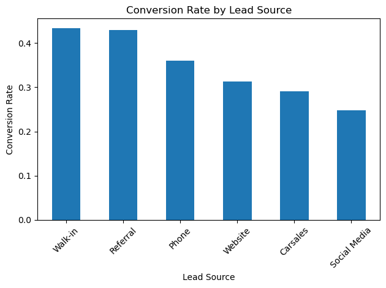
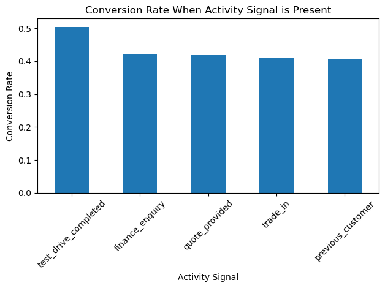
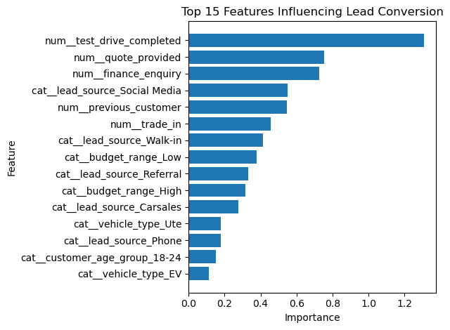
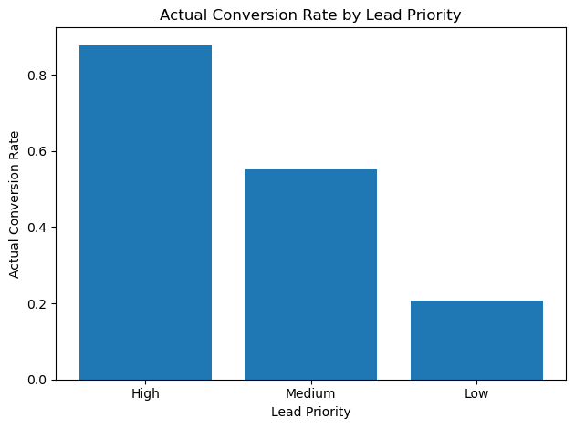

# Car Dealership Lead Conversion Analytics

## Project Overview

This project predicts which car dealership customer leads are most likely to convert into vehicle purchases using CRM-style sales and enquiry data.

The aim is to build a practical lead scoring model that helps dealership sales teams prioritise high-intent customers, improve follow-up efficiency and understand the key factors that influence conversion.

The project uses a synthetic dealership CRM dataset containing lead source, customer profile, vehicle interest, finance enquiry, trade-in status, test drive completion, quote status, response time, follow-up activity and final conversion outcome.

## Business Problem

Car dealerships receive leads from multiple sources such as websites, walk-ins, phone enquiries, referral campaigns, social media and online car marketplaces.

However, not every lead has the same likelihood of converting into a sale. Some customers are ready to buy, while others are still browsing. Without a structured lead scoring process, sales teams may spend too much time on low-intent leads while missing high-potential customers.

This project answers the question:

**Which customer leads are most likely to convert into vehicle purchases, and what factors influence conversion?**

## Objectives

- Generate a realistic synthetic dealership CRM dataset
- Explore lead conversion patterns across customer, enquiry and sales activity data
- Build a classification model to predict conversion likelihood
- Score leads into high, medium and low priority groups
- Translate model results into practical sales and marketing recommendations

## Dataset

The dataset contains 1,500 synthetic dealership leads with the following fields:

- Lead source
- Customer age group
- Customer location
- Vehicle type
- New, used or demo vehicle interest
- Budget range
- Finance enquiry
- Trade-in interest
- Test drive completion
- Quote provided
- Previous customer status
- Sales response time
- Follow-up count
- Days since enquiry
- Conversion outcome

The final conversion rate in the generated dataset is approximately **34%**.

## Tools & Technologies

- Python
- Pandas
- NumPy
- Matplotlib
- Scikit-learn
- XGBoost
- Jupyter Notebook

## Project Workflow

### 1. Dataset Generation

A synthetic CRM-style dataset was generated to reflect realistic dealership lead behaviour. The conversion outcome was created using weighted business logic, where stronger buying-intent signals increase conversion probability.

Key signals included:

- Test drive completed
- Finance enquiry
- Trade-in interest
- Quote provided
- Previous customer status
- Lead source
- Response time
- Follow-up count
- Days since enquiry

### 2. Exploratory Data Analysis

The exploratory analysis examined conversion patterns across lead source, customer profile and sales activity variables.





### 3. Model Training

Classification models were trained to predict whether a lead would convert into a vehicle purchase.

Models tested:

- Logistic Regression
- Random Forest
- XGBoost

The best model was selected using ROC-AUC because the business goal is to rank leads by conversion likelihood, not just classify them as converted or not converted.



### 4. Lead Scoring

The model prediction probabilities were converted into sales priority groups:

| Priority | Conversion Probability | Recommended Action |
|---|---:|---|
| High | 70%+ | Call within 1 hour, offer test drive, prepare personalised quote |
| Medium | 40%–70% | Follow up within 24 hours, confirm interest, send finance or trade-in options |
| Low | Below 40% | Add to nurture campaign and review if engagement increases |



## Key Insights

- Test drive completion is one of the strongest buying-intent signals.
- Finance enquiry, trade-in interest and quote requests are associated with higher conversion probability.
- Referral and walk-in leads tend to show stronger conversion potential than lower-intent digital channels.
- Faster response times support stronger conversion outcomes.
- Lead scoring helps sales teams prioritise daily follow-up activity more effectively.

## Business Recommendations

1. Prioritise high-probability leads for immediate salesperson follow-up.
2. Treat test drive completion, finance enquiry, trade-in interest and quote requests as strong buying-intent signals.
3. Use medium-priority leads for structured follow-up within 24 hours.
4. Move low-priority leads into longer-term nurture campaigns instead of using heavy sales effort immediately.
5. Review lead source quality regularly, as some channels may generate high volume but lower conversion potential.

## Project Structure

```text
car-dealership-lead-conversion/
│
├── data/
│   ├── raw/
│   │   └── dealership_leads.csv
│   └── processed/
│       ├── model_test_predictions.csv
│       └── scored_leads.csv
│
├── notebooks/
│   ├── 01_generate_dataset.ipynb
│   ├── 02_exploratory_analysis.ipynb
│   ├── 03_model_training.ipynb
│   └── 04_lead_scoring.ipynb
│
├── src/
│   └── generate_dataset.py
│
├── visuals/
│   ├── conversion_by_lead_source.png
│   ├── conversion_by_activity_signal.png
│   ├── conversion_by_response_time.png
│   ├── conversion_by_follow_up_count.png
│   ├── feature_importance.png
│   ├── conversion_by_lead_priority.png
│   └── high_priority_leads_by_source.png
│
├── README.md
└── requirements.txt
```
