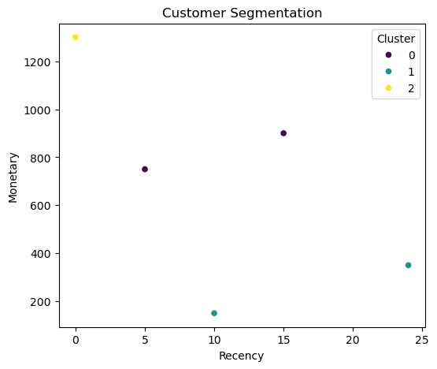

# Customer Segmentation & Behavior Analytics

Data analytics project using **RFM analysis** and **K-Means clustering** to segment customers based on purchasing behavior.

## Project Overview

This project:

- processes transactional data
- computes Recency, Frequency, Monetary (RFM)
- applies clustering to identify customer segments
- generates insights for business decision-making

## Technologies Used

- Python
- Pandas
- Scikit-learn
- Matplotlib / Seaborn

## Project Structure
```text
customer-segmentation/
├── data/
├── notebooks/
├── src/
├── outputs/
└── examples/
```


## Example Output



## Key Insights

- High-value customers identified
- Frequent vs low-engagement segments
- Revenue concentration across segments

## Use Cases

- Targeted marketing
- Customer retention
- Revenue optimization
