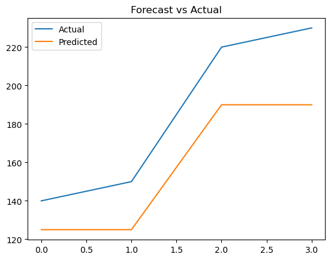

# Demand Forecasting & Sales Prediction

Machine learning project using **XGBoost** to predict product demand based on historical sales data.

## Overview

This project:

- processes time-series sales data
- engineers date-based features
- trains a regression model
- predicts future demand

## Technologies

- Python
- Pandas
- XGBoost
- Matplotlib

## Example Output

## Key Insights

- Demand trends captured using ML
- Product-based differences identified
- Time-based patterns influence sales

## Use Cases

- Inventory planning
- Supply chain optimization
- Demand forecasting
